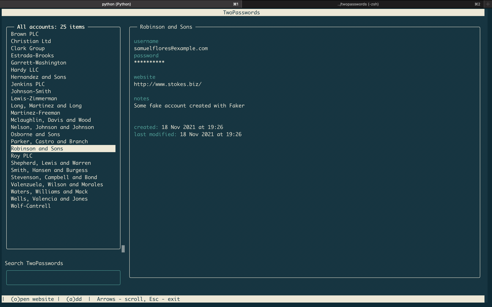

# twopasswords’ Trust Percentiles

Note: This is a forked repo. The original repo is [here](https://github.com/gennadis/twopasswords).
*Data as of January 31, 2024*

<center></center>

This grade is based on the percentile rankings of the 3 trust component scores below, which are compared with the top 1000 most-downloaded npm libraries.

<details>
<summary><span style="font-size: 20px;"><strong>Community Activity and Integrity -- </strong>Beats <strong><span style="color: blue;">2.5%</span></strong> Other Repos</summary>
<div>
<div align=center>
  
</div>
<!-- <center></center><br> -->
Activity and usage by this project’s consumers and contributors. More people using and contributing to this project increases these metrics.<br><br>
</div>
<table>
  <tr>
    <td>
      <div>
        <strong>Usage Popularity:</strong> Beats <strong>9.9%</strong>
        <p>How much consumers use this project: stars, watches, forks, downstream dependents.</p>
      </div>
      <div>
        <strong>Code Contribution:</strong> Beats <strong>0.0%</strong>
        <p>Activity which adds to the codebase: commits and PRs.</p>
      </div>
    </td>
    <td>
      <div>
        <strong>Contributor Participation:</strong> Beats <strong>0.0%</strong>
        <p>Activity in discussion and participation: number of contributors, comments made, quality of comments.</p>
      </div>
      <div>
        <strong>Contributor Growth:</strong> Beats <strong>0.0%</strong>
        <p>How the project is scaling in size: change in contributors, PRs.</p>
      </div>
    </td>
  </tr>
</table>
</details>


<details>
<summary><span style="font-size: 20px;"><strong>Maintenance and Goodwill -- </strong>Beats <strong><span style="color: blue;">15.8%</span></strong> Other Repos</summary>
<div>
<div align=center>
  
</div>
<!-- <center></center><br> -->
Activity and involvement by this project’s maintainer(s) for the benefit of the project community. Maintainers could increase these metrics by extending documentation and being more responsive to community participation (especially issues and PRs).<br><br>
</div> 
<table>
  <tr>
    <td>
      <div>
        <strong>Issues Maintenance:</strong> Beats <strong>0.0%</strong>
        <p>How efficiently issues are addressed: issues closed and comments on issues.</p>
      </div>
      <div>
        <strong>Community Documentation:</strong> Beats <strong>38.9%</strong>
        <p>Support for the community to participate: issue and PR templates, code of conduct, governance, etc.</p>
      </div>
    </td>
    <td>
      <div>
        <strong>Code Maintenance:</strong> Beats <strong>0.0%</strong>
        <p>How efficiently code changes are addressed: commits and PRs closed, commit standards.</p>
      </div>
      <div>
        <strong>Maintainer History:</strong> Beats <strong>24.2%</strong>
        <p>Maintainer experience: maintainers' other projects.</p>
      </div>
    </td>
  </tr>
</table>
</details>


<details>
<summary><span style="font-size: 20px;"><strong>Code Quality -- </strong>Beats <strong><span style="color: blue;">3.0%</span></strong> Other Repos</summary>
<div>
<div align=center>
  
</div>
<!-- <center></center><br> -->
Security and scalability of the project’s code. Contributors can increase these metrics by maintaining the dependencies and setting up automated testing and procedural reviews.<br><br>
</div>  
<table>
  <tr>
    <td>
      <div>
        <strong>Dependencies Health:</strong> Beats <strong>11.5%</strong>
        <p>Mitigation of dependency vulnerability risk: dependency versions, reported vulnerabilities.</p>
      </div>
      <div>
        <strong>Review Coverage:</strong> Beats <strong>0.2%</strong>
        <p>Scale of manual code reviews: contributors and reviewers per code portion, commit sizes.</p>
      </div>
    </td>
    <td>
      <div>
        <strong>Testing Quality:</strong> Beats <strong>0.0%</strong>
        <p>Scale of automated tests: workflow runs, check runs, code authors.</p>
      </div>
      <div>
        <strong>Project Maturity:</strong> Beats <strong>0.3%</strong>
        <p>Size and age of repo: lines of code, creation time, versions.</p>
      </div>
    </td>
  </tr>
</table>
</details>


​																				[Metric Details](https://github.com/Elijahzyp/twopasswords_TrustLabel/blob/main/Trust%20Percentiles%20Template%20Metric%20Details.md)


***


# TwoPasswords

[](https://pypi.org/project/twopasswords)
[](https://raw.githubusercontent.com/gennadis/twopasswords/main/LICENSE)

TwoPasswords is a simple Python password manager, that uses Face Recognition as a second factor.
It allows you to securely save account credentials with a simple TUI interface.




## Features
- Account credentials stored locally in an encrypted SQLite database with [SQLCipher](https://www.zetetic.net/sqlcipher/)
- Passwords can be passed to Clipboard
- Passwords can be generated in [XKCD style](https://xkcd.com/936/)
- Import and Export in JSON


## Basic Usage
To start using TwoPasswords, you have to register your face and enter your new Master Password.

## Installation notes
1. TwoPasswords requires `cmake` to be installed on your machine.
```bash
pip3 install cmake
```

2. TwoPasswords requires `sqlcipher` to be installed on your machine.

On MacOS, you can install it with [brew](https://brew.sh/):
```bash
brew install sqlcipher
pip3 install sqlcipher3==0.4.5

# If you are getting an error "Failed to build sqlcipher3", you would need to fix the build flags:
SQLCIPHER_PATH="$(brew --cellar sqlcipher)/$(brew list --versions sqlcipher | tr ' ' '\n' | tail -1)"
C_INCLUDE_PATH=$SQLCIPHER_PATH/include LIBRARY_PATH=$SQLCIPHER_PATH/lib pip3 install sqlcipher3==0.4.5
```

3. Also you need to install latest ffmpeg library for a latest OpenCV version
```bash
brew install ffmpeg
```


### Installing via PyPI

```bash
pip3 install twopasswords

# Run setup
twopasswords
```

### Installing via cloning this project

```bash
# Clone project
git clone https://github.com/gennadis/twopasswords.git 
cd twopasswords

# Installation
python3 setup.py install

# Run setup
twopasswords
```
